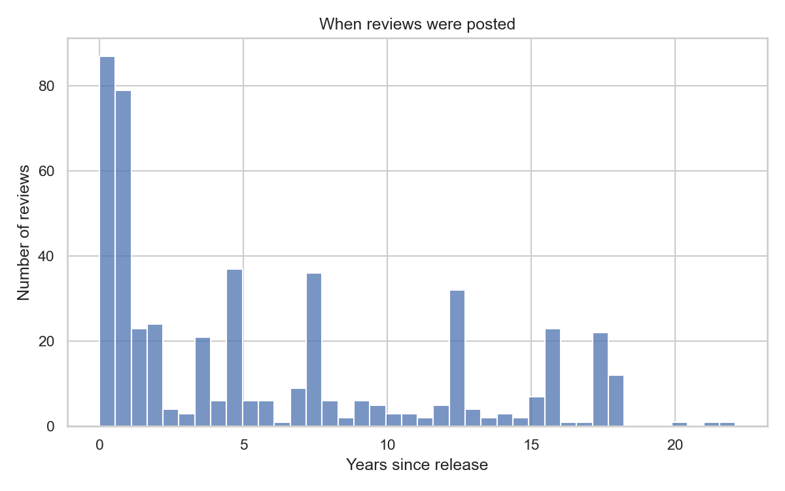

# Data Summary

The `DATA` folder contains two related CSV files with 486 reviews of 21 films from the Spider-Man, Avengers, Captain America, and Iron Man franchises. The reviews were returned by The Movie Database (TMDB) API using its English-language (`en-US`) review endpoint.

- `marvel_movie_reviews.csv` is the collection-stage dataset. It contains the movie and franchise identifiers, review text and identifier, film release date, review date, and the number of days between release and review.
- `marvel_movie_reviews_lexicon_sentiment.csv` is the final dataset used for analysis. It contains every column from the collection-stage dataset plus positive-word, negative-word, and total-token counts and a normalized polarity score.

Both files contain the same 486 unique reviews and have no missing values in their current columns. The current snapshot contains 21 films across four franchise groups. Because TMDB users can add or update reviews, rerunning the collection notebook later may produce a different number of observations and different results.

# Provenance

The reviews are user-generated contributions retrieved through the official TMDB API rather than by scraping the TMDB website. The collection notebook, [`TMDB_Script.ipynb`](../SCRIPTS/TMDB_Script.ipynb), searches for 21 selected films by title and release year, retrieves every available page of reviews returned by the `en-US` endpoint, and saves the results to `marvel_movie_reviews.csv`.

For each review, the collection process retains the TMDB movie identifier, movie title, film release date, manually assigned franchise group, TMDB review identifier, full review text, and original creation date. The original review timestamp is converted to a `YYYY-MM-DD` date, and `days_since_release` is calculated as the review date minus the film release date. Review identifiers are unique in the current snapshot and are retained for record identification and duplicate checking.

The sentiment notebook, [`TMDB_Lexicon_Sentiment.ipynb`](../SCRIPTS/TMDB_Lexicon_Sentiment.ipynb), reads the collection-stage CSV and creates `marvel_movie_reviews_lexicon_sentiment.csv`. It tokenizes alphabetic words and contractions, converts them to lowercase, and compares them with the Bing Liu Opinion Lexicon. The polarity score is calculated as:

**polarity score = (positive word count - negative word count) / total token count**

# License

Use of TMDB data is subject to TMDB's API terms and attribution requirements [1], [2]. The repository's MIT license applies to the group's original code and documentation; it does not transfer ownership of TMDB data or user-written review text. The required attribution notice is:

> This product uses the TMDB API but is not endorsed or certified by TMDB.

# Ethical Statements

The reviews are publicly posted, user-generated content and remain the property of their original authors. The repository retains the review text and TMDB review identifier but does not include reviewer names, usernames, profile information, or ratings. The data are used for academic analysis, and findings are reported in aggregate rather than as evaluations of individual reviewers.

Lexicon-based sentiment scores are imperfect representations of a reviewer's opinion. The method may not correctly interpret context, sarcasm, negation, unusual spelling, or words that are absent from the lexicon. The polarity score should therefore be interpreted as a reproducible text measure rather than a definitive judgment of a review's meaning.

# Data Dictionary

## Columns in both CSV files

| Feature | Type | Description | Uncertainty / Notes |
|---|---|---|---|
| `movie_id` | integer | TMDB identifier for the film associated with the review | Repeated across reviews of the same film; use with `movie` to identify the film |
| `movie` | string | Film title returned by TMDB | Titles are not guaranteed to be globally unique, so `movie_id` is the more reliable identifier |
| `release_date` | date (`YYYY-MM-DD`) | TMDB release date for the film | Taken from the movie metadata returned during collection |
| `franchise` | string | Manually assigned franchise group: Spider-Man, Avengers, Captain America, or Iron Man | Used for grouped analysis and does not represent an official TMDB category |
| `review_id` | string | TMDB identifier for the individual review | Unique across the 486 reviews in the current snapshot |
| `review` | string | Full text of the TMDB user review | User-generated text varies in length, spelling, formatting, and language quality |
| `review_date` | date (`YYYY-MM-DD`) | Date the review was originally posted | Derived from TMDB's creation timestamp after converting it to UTC and removing the time component |
| `days_since_release` | integer | Number of days from the film's release date to the review date | Calculated as `review_date - release_date`; two reviews in the current snapshot were posted one day before release and therefore have a value of `-1` |

## Additional columns in the final sentiment dataset

| Feature | Type | Description | Uncertainty / Notes |
|---|---|---|---|
| `positive_word_count` | integer | Number of cleaned review tokens found in the Bing Liu positive-word list | Lexicon matching does not account for context, sarcasm, or negation |
| `negative_word_count` | integer | Number of cleaned review tokens found in the Bing Liu negative-word list | Lexicon matching does not account for context, sarcasm, or negation |
| `total_word_count` | integer | Number of alphabetic words and contractions retained by the tokenizer | Punctuation and numeric-only tokens are excluded; this is a cleaned token count rather than a general-purpose word count |
| `polarity_score` | numeric | Normalized sentiment score: `(positive_word_count - negative_word_count) / total_word_count` | Higher values indicate more positive lexicon matches; the score is not a TMDB user rating |

# Exploratory Plots

The MI2 project outline contained preliminary exploratory plots based on an earlier 485-review snapshot. For MI3, those preliminary figures have been replaced below with plots generated from the current 486-review sentiment dataset by [`sentiment_time_analysis.ipynb`](../SCRIPTS/sentiment_time_analysis.ipynb).

**Figure 1. Review Mentions of Characters and Actors.** This graph shows the number of reviews that mention specific actors or characters. Because these actors and characters appear across multiple films, identifying how frequently they are referenced provides context for interpreting the content and sentiment of the reviews. Differences in the number of available reviews for each film should also be considered when comparing these mentions.

**Figure 2. Distribution of review timing.** The histogram shows how many years after a film's release its reviews were posted. Reviews span both the release period and many years afterward.

**Figure 3. Reviews Overtime By Franchise.** This figure shows the number of reviews posted over time for each franchise. Because the movies were released on different dates, comparing review activity across time helps identify periods when reviews were more concentrated and provides context for examining how the timing of reviews may relate to sentiment.

# References

[1] "API Terms of Use - The Movie Database (TMDB)," *The Movie Database*. Accessed: Sep. 16, 2026. [Online]. Available: https://www.themoviedb.org/api-terms-of-use

[2] "FAQ," *The Movie Database Developer Documentation*. Accessed: Sep. 16, 2026. [Online]. Available: https://developer.themoviedb.org/docs/faq

[3] "Spearman's Rank-Order Correlation - A Guide to When to Use It, What It Does and What the Assumptions Are," *Laerd Statistics*. Accessed: Sep. 18, 2026. [Online]. Available: https://statistics.laerd.com/statistical-guides/spearmans-rank-order-correlation-statistical-guide.php
